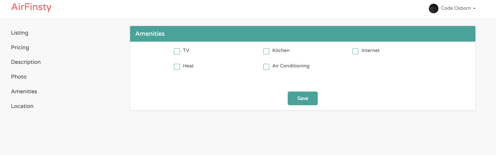
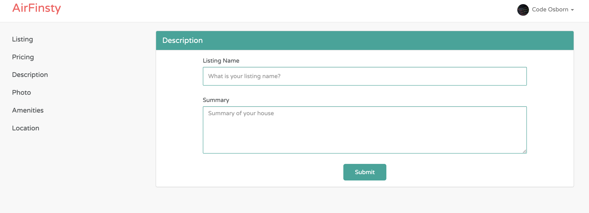

# README

## AirFinsty
This Application is a vacational rental booking website that allows for repeat or new guests to book directly with Finsty Properties. It showcases his properties in Colorado and Arizona and mocks the same functionality you'd see on Airbnb.

Here's some screenshots of the Rental listing creation, and allowing for quick ease of adding/removing amenities or othe features of the Rental to attract the most guests.

## Table of Contents

If your README is long, add a table of contents to make it easy for users to find what they need.

- [README](#readme)
  - [AirFinsty](#airfinsty)
  - [Table of Contents](#table-of-contents)
    - [Installation](#installation)

This README would normally document whatever steps are necessary to get the
application up and running.

### Installation

* Ruby version: `3.0`

* System dependencies: `Postgresql`

* Configuration

* Database creation: `rails db:setup`

* Database initialization: `rails db:create`

* How to run the test suite: `rspec` or to run a file independently `rspec app/models/rentals_spec.rb`

* Services (job queues, cache servers, search engines, etc.)

* Deployment instructions
